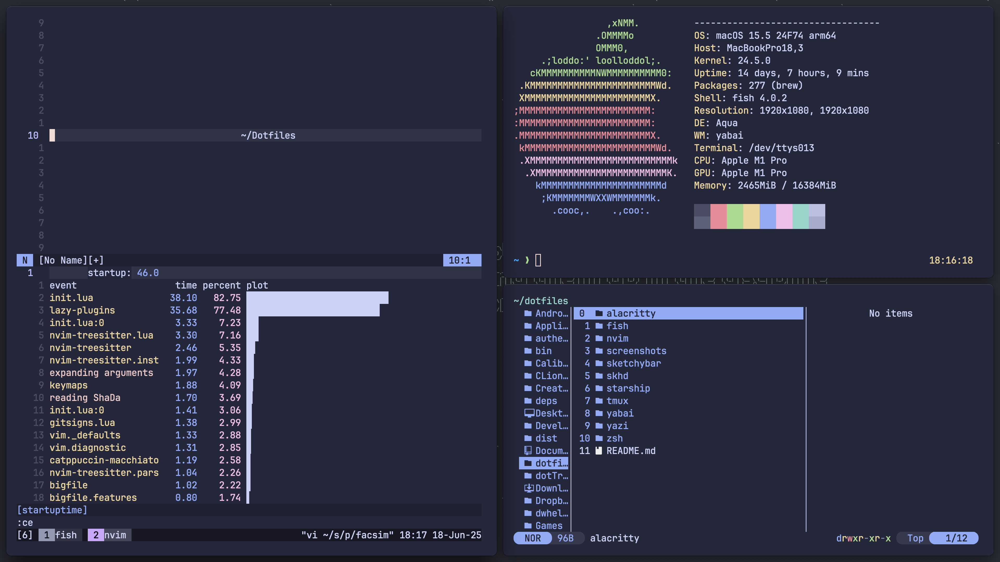

# Dotfiles

My personal dotfiles, managed by [GNU Stow](https://www.gnu.org/software/stow/).
Each directory is a self-contained package for stow, so that the configuration
is modular, for different platforms.

## Preview



Neovim + Fish + Starship + Tmux + Yazi

## Dependencies

- [GNU Stow](https://www.gnu.org/software/stow/)
- [Git](https://git-scm.com/downloads)

## Managed Programs

- [alacritty](https://github.com/alacritty/alacritty/blob/master/INSTALL.md) -- Terminal emulator config
- [fish](https://github.com/fish-shell/fish-shell?tab=readme-ov-file#getting-fish) - Shell configuration 
- [nvim](https://github.com/neovim/neovim/blob/master/INSTALL.md#install-from-package) - Modular-Kickstart Neovim setup with plugins
- [sketchybar](https://felixkratz.github.io/SketchyBar/setup) - macOS status bar customization (out of use)
- [skhd](https://github.com/koekeishiya/skhd?tab=readme-ov-file#install) - macOS hotkey daemon
- [starship](https://starship.rs/#quick-install) - Terminal prompt configuration
- [tmux](https://github.com/tmux/tmux/wiki/Installing) - Terminal multiplexer configuration
- [yabai](https://github.com/koekeishiya/yabai/wiki/Installing-yabai-(latest-release)) - macOS tiling window manager config
- [yazi](https://yazi-rs.github.io/docs/installation/) - Terminal file manager configuration
- [zsh](https://github.com/ohmyzsh/ohmyzsh/wiki/Installing-ZSH#how-to-install-zsh-on-many-platforms) - Legacy shell support 

## Installation

1. **Clone the repo**

```bash
git clone https://github.com/ProfXwing/dotfiles ~/dotfiles --recurse-submodules
cd ~/dotfiles
```

2. **Stow the desired packages**

```bash
stow *
```

## Contributing

Never contribute to another man's dotfiles...

(But I won't stop you.)
